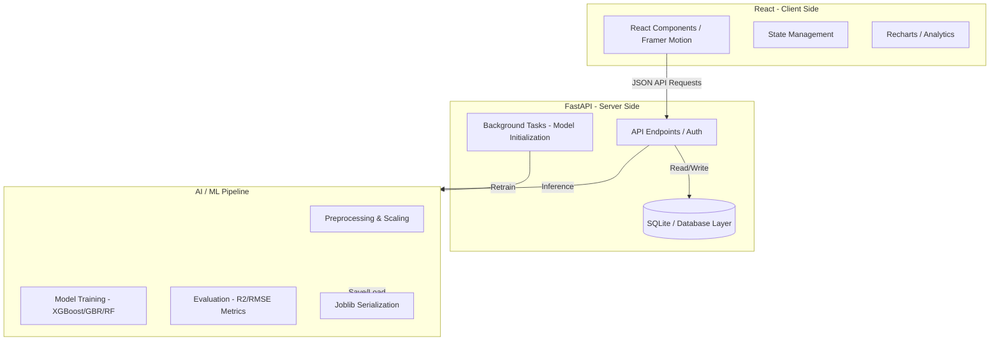

# VaenEstate - Intelligent House Price Prediction Platform

VaenEstate is a full-stack, AI-powered property valuation platform designed to provide accurate house price predictions using advanced Machine Learning techniques. It combines a high-performance **FastAPI** backend with a modern, dynamic **React** dashboard.

## 🏗️ System Architecture

The following diagram illustrates the interaction between the core components of the system:



---

## 🚀 Key Features

- **Crystal-Ball Pricing**: Real-time house price prediction based on location, area, bedrooms, and amenities.
- **Location Intelligence**: Integrated maps and location-based scoring to understand neighborhood value.
- **Model Lab**: Transparency into the AI process—compare performance between Gradient Boosting, Random Forest, and XGBoost.
- **Dynamic Analytics**: Visual insights into market trends, price distribution, and feature importance.
- **Retrainable Intelligence**: Background training pipeline that improves the model as new data arrives.

---

## 🛠️ Technical Stack

- **Frontend**: React 19, Vite, Tailwind CSS, Recharts (Charts), Leaflet (Maps), Framer Motion (Animations).
- **Backend**: FastAPI, Pydantic, SQLAlchemy (SQLite), JWT Authentication.
- **Machine Learning**: Scikit-Learn, XGBoost, Pandas, Numpy, Joblib.
- **Keep-Alive**: Integrated `/ping` and `/health` endpoints for 24/7 uptime monitoring.

---

## 📂 Project Structure

```text
├── api/                    # Vercel Serverless Entry Point
├── backend/                # Primary API & ML Logic
│   ├── app/
│   │   ├── api/            # API Route Handlers
│   │   ├── ml/             # ML Pipeline, Preprocessing, Training
│   │   ├── schemas/        # Pydantic Models
│   │   ├── config.py       # Global Configuration
│   │   ├── database.py     # DB Initialization
│   │   └── main.py         # App Entry Point & Keep-Alive
│   ├── data/               # Models (*.joblib) and Datasets (*.csv)
│   ├── retrain.py          # Manual Model Retraining Script
│   └── requirements.txt    # Python Dependencies
├── frontend/               # UI Dashboard
│   ├── src/
│   │   ├── api/            # Frontend API Client
│   │   ├── components/     # UI Design System
│   │   └── pages/          # Dashboard, Analytics, Model Lab
│   └── package.json        # Frontend Dependencies
├── docker-compose.yml      # Container Orchestration
└── vercel.json            # Vercel Deployment Config
```

---

## 📥 Run Locally

### 1. Backend Setup
```bash
cd backend
python -m venv .venv
source .venv/bin/activate  # Or .\.venv\Scripts\activate.ps1 on Windows
pip install -r requirements.txt
uvicorn app.main:app --reload
```

### 2. Frontend Setup
```bash
cd frontend
npm install
npm run dev
```

---

## ☁️ Deployment

- **Hosting**: Designed for **Vercel** (Serverless) and **Render/Railway** (Docker/Managed).
- **Continuous Availability**: The backend includes `/ping` endpoints designed for **Uptime Robot** to prevent server idling.
- **Database**: Uses a portable SQLite database with automatic initialization.

---

## 🛡️ License
Copyright © 2026 VaenEstate Team. All rights reserved.
